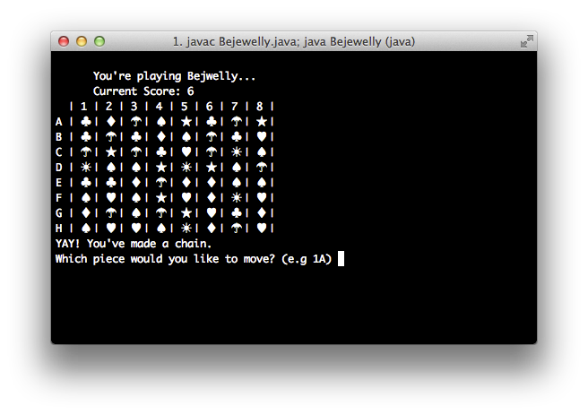

BEJEWELED - Java Command Line Edition!
========================================
Recompile and run with `javac Bejewelly.java; java Bejewelly`
Recompile Jar with `jar cfe Bejewelly.jar Bejewelly *.class`
Run jar with `java -jar Bejewelly.jar`
-----------------------------------------------
Still a lil buggy. But seemingly functional. Now with Multipliers! :-)
